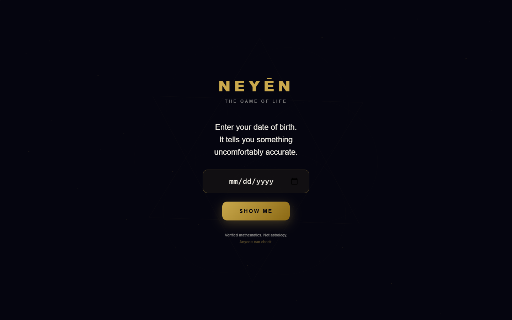
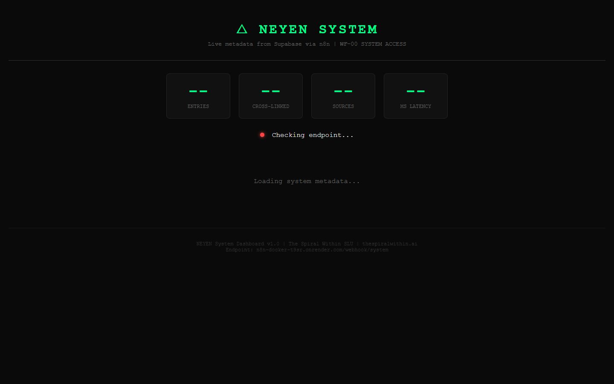

# zero-cost-ops

**Production monitoring for solo founders. $0/month. No excuses.**

[](LICENSE)
[](CONTRIBUTING.md)
[](https://n8n.io)
[](https://supabase.com)
[](https://pages.github.com)

---

<table>
<tr>
<td align="center" width="50%">

<br><em>CTO Cockpit — traffic-light semaphores, incident log, morning sync</em>
</td>
<td align="center" width="50%">

<br><em>System Dashboard — live metadata from Supabase via n8n</em>
</td>
</tr>
</table>

---

## What is this?

A complete CTO-grade operations dashboard and automation pipeline that runs entirely on free tiers. Built by a solo founder who got tired of paying for monitoring tools that did less than what she could build in a weekend.

Monitors n8n workflows, Slack channels, GitHub repos, Cloudflare, LinkedIn, and Meta — with traffic-light semaphores, incident tracking, and a 60-second morning sync. Ingests content automatically via webhook, classifies it with Claude AI, cross-links related entries, and builds a searchable metadata layer in Supabase. Ships as a PWA you can pin to your phone and open at 7am to know exactly what's broken (and what isn't).

This is the real system. Not a demo. Open-sourced so other solo founders don't have to build it from scratch.

---

## Architecture

```
┌─────────────────────────────────────────────────────────────────┐
│                        DATA SOURCES                             │
│  Slack    GitHub    Cloudflare    LinkedIn    Meta    Webhooks   │
└────────────────────────────┬────────────────────────────────────┘
                             │  HTTP POST to webhook
                             ▼
┌─────────────────────────────────────────────────────────────────┐
│                    n8n (Render free tier)                       │
│                                                                  │
│  WF-01: Ingest → Claude classify → Supabase insert → trigger   │
│  WF-04: Timeline → temporal cluster → narrative arc → update    │
└────────────────────────────┬────────────────────────────────────┘
                             │  REST API (anon key)
                             ▼
┌─────────────────────────────────────────────────────────────────┐
│                   Supabase (free tier)                          │
│                                                                  │
│  PostgreSQL 15 · RLS · Real-time · 5 tables · GIN indexes       │
└────────────────────────────┬────────────────────────────────────┘
                             │  fetch() from browser
                             ▼
┌─────────────────────────────────────────────────────────────────┐
│               GitHub Pages (free, custom domain)                │
│                                                                  │
│  dashboard/cto-cockpit.html   →   Your phone (PWA)             │
│  dashboard/system-dashboard.html  →  Status overview            │
└─────────────────────────────────────────────────────────────────┘
```

---

## The Stack (and what it costs)

| Service | What it does | Free tier limit | Cost |
|---------|-------------|-----------------|------|
| **n8n on Render** | Automation workflows, webhook ingestion, Claude AI calls | 750 hours/month (always on with keep-alive) | **$0** |
| **Supabase** | PostgreSQL database, auth, real-time, RLS | 500MB storage, 50K API calls/month | **$0** |
| **GitHub Pages** | Static dashboard hosting, custom domain, HTTPS | 100GB bandwidth/month, unlimited sites | **$0** |
| **Cloudflare** | DNS, DDoS protection, analytics | Unlimited DNS, 100K requests/day | **$0** |
| **UptimeRobot** | External uptime monitoring, 5-min checks | 50 monitors | **$0** |
| **Claude API** | Content classification (optional) | Pay-as-you-go, ~$0.01/classification | **$0*** |

**Total: $0/month** *(Claude API optional — disable the classify step to stay fully free)*

---

## Features

- 🟢 **Traffic-light semaphores** — green/yellow/red status for every service at a glance
- ⚡ **Auto-ingestion pipeline** — webhook receives content, Claude classifies it, Supabase stores it
- 🤖 **AI classification** — Claude API extracts tags, entities, narrative role, timeline group
- 🔗 **Cross-linking engine** — related entries automatically linked by semantic similarity
- 📅 **Narrative timeline** — content clustered by time period and narrative arc
- 📱 **PWA mobile-first** — install to home screen, offline-capable service worker
- 🌑 **Dark cockpit theme** — monospace, #0a0a0a background, easy on eyes at 7am
- ☁️ **Zero-infrastructure** — no servers to manage, no Docker, no DevOps

---

## Quick Start

**You'll have a working dashboard in under 30 minutes.**

### 1. Fork this repo

```bash
# Fork on GitHub, then:
git clone https://github.com/YOUR_USERNAME/zero-cost-ops.git
cd zero-cost-ops
```

### 2. Set up Supabase

1. Create a free account at [supabase.com](https://supabase.com)
2. Create a new project (choose EU region for GDPR if relevant)
3. Go to SQL Editor and run `schema/supabase-schema.sql`
4. Copy your project URL and anon key from Settings > API

### 3. Deploy n8n on Render

1. Create a free account at [render.com](https://render.com)
2. New > Web Service > Docker
3. Use image: `n8nio/n8n:latest`
4. Set environment variables:
   ```
   N8N_BASIC_AUTH_ACTIVE=true
   N8N_BASIC_AUTH_USER=admin
   N8N_BASIC_AUTH_PASSWORD=your-secure-password
   SUPABASE_URL=https://YOUR-PROJECT.supabase.co
   SUPABASE_SERVICE_ROLE_KEY=your-service-role-key
   ```
5. Note your Render URL: `https://your-n8n.onrender.com`

### 4. Import workflows

1. In n8n, go to Workflows > Import from File
2. Import `workflows/WF-01-ingestion-pipeline.json`
3. Import `workflows/WF-04-timeline-engine.json`
4. Update Supabase credentials in each workflow
5. Activate both workflows

### 5. Configure the dashboard

Edit `dashboard/system-dashboard.html` — find the `API` constant and update:
```javascript
const API = 'https://YOUR-N8N-INSTANCE.onrender.com/webhook/system';
```

Edit `dashboard/cto-cockpit.html` — update the `CONFIG` object with your services.

### 6. Enable GitHub Pages

1. Go to your repo Settings > Pages
2. Source: Deploy from a branch > main > / (root)
3. (Optional) Add custom domain via Cloudflare

### 7. Add keep-alive for Render free tier

Render free instances sleep after 15 minutes of inactivity. Add a UptimeRobot monitor to ping your n8n health endpoint every 5 minutes:

```
https://YOUR-N8N-INSTANCE.onrender.com/healthz
```

That's it. Your CTO cockpit is live.

---

## Workflows Included

### WF-01: Ingestion Pipeline

**What it does:** Receives content via webhook → filters noise → classifies with Claude AI → stores in Supabase → triggers cross-linking.

```
Webhook → Extract Content → Filter → Claude Classify → Parse → Supabase Insert → Trigger WF-02 → Respond
```

**Inputs:** Any POST to `/webhook/wf01-ingest` with `{ text, source, user_id }`  
**Output:** Classified entry in Supabase `metadata` table with tags, entities, narrative role, and timeline group  
**Claude model:** `claude-sonnet-4-20250514`

### WF-04: Timeline Engine

**What it does:** Scans all entries in Supabase → clusters by time period → detects narrative arc patterns → updates `timeline_group` field in bulk.

```
Webhook → Fetch All → Temporal Clustering → Narrative Arc Detection → Batch Update → Summary
```

**Run:** Trigger manually or on a schedule (weekly recommended)  
**Output:** All entries tagged with `1974-1990 | 2019-2023 | 2024-2026` + narrative role analysis

See [workflows/README.md](workflows/README.md) for detailed documentation.

---

## Customization

This system is designed to be adapted, not just deployed. You can:

- **Change monitored services** — edit the `CONFIG` object in `cto-cockpit.html`
- **Add new workflows** — follow the same pattern as WF-01 (webhook → process → Supabase)
- **Modify the schema** — add columns to `metadata` or create new tables
- **Replace Claude** — swap the HTTP request node for any other LLM API
- **Add authentication** — Supabase Auth is already configured in the schema

See [docs/CUSTOMIZATION.md](docs/CUSTOMIZATION.md) for a full guide.

---

## Live Demo

- **Main app:** [neyen.thespiralwithin.ai](https://neyen.thespiralwithin.ai)
- **System dashboard:** [neyen.thespiralwithin.ai/system.html](https://neyen.thespiralwithin.ai/system.html)

---

## Contributing

Issues, PRs, and feedback welcome. See [CONTRIBUTING.md](CONTRIBUTING.md).

---

## Built by

**Ana Ballesteros Benavent**  
CTO, NEYEN / The Spiral Within SLU  
Valencia, Spain

[thespiralwithin.ai](https://thespiralwithin.ai) · [GitHub: ProyectoAna](https://github.com/ProyectoAna)

Built this because I needed it. Sharing it because you might too.

---

## License

MIT — see [LICENSE](LICENSE). Use it, fork it, ship it.
